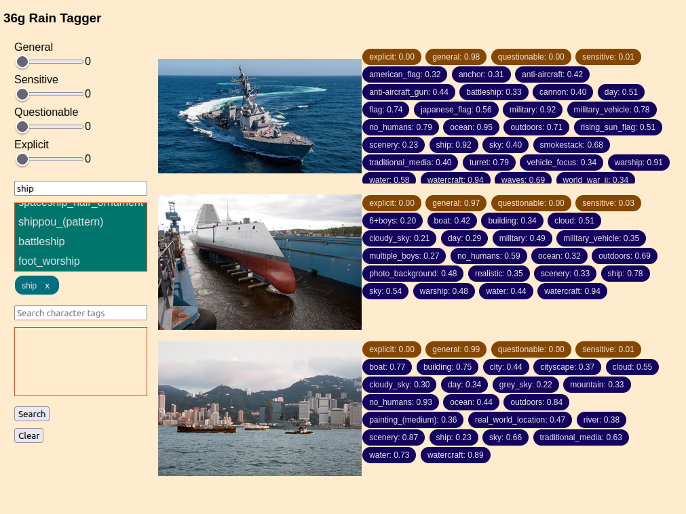

# 36g Rain Tagger

36g Rain Tagger provides image tagging with timm using the WD Tagger V3 models. It is named after [36g](https://vocaloid.fandom.com/wiki/36g).

## Set Up

Select your pytorch configuration by going through the menu at [https://pytorch.org/get-started/locally/](https://pytorch.org/get-started/locally/). If you're using a CPU on Ubuntu, it should be something like `python3.12 -m pip install torch --index-url https://download.pytorch.org/whl/cpu`. You don't need `torchvision` or `torchaudio`. If you're using a GPU on Ubuntu, `python3.12 -m pip install torch` will suffice.

```bash
git clone https://github.com/skwzrd/36g-Rain-Tagger
cd 36g-Rain-Tagger
python3.12 -m venv venv
source venv/bin/activate
python3.12 -m pip install -r requirements.txt
```

## Usage

An example,

```
python3.12 main.py --bsize 1 --gmin 0.1 --cmin 0.2 --exts jpg,jpeg,png,gif --printt --path /path/to/image.png
```

All the cli command options,

```
Image tagging utility for extracting and saving tags from images.

options:
  -h, --help             show this help message and exit
  --path PATH            Path to an image file or a directory containing images. Can also accept a list of paths.
  --gmin GMIN            Minimum probability threshold for general tags. Range: [0.0, 1.0], where 1.0 means a very strong match. Default: 0.2
  --cmin CMIN            Minimum probability threshold for character tags. Range: [0.0, 1.0], where 1.0 means a very strong match. Default: 0.2
  --exts EXTS            Comma-separated list of valid image file extensions to process. Default: png,jpeg,jpg,gif
  --nmax NMAX            Maximum number of images to tag. Set to 0 to process all images found in the specified path. Default: 0
  --bsize BSIZE          Batch size for processing images. For faster processing, use a batch size of 1. Default: 1
  --db_name DB_NAME      Name of the SQLite database file to save results. Default: ./image.db
  --skip, --no-skip      Skip images that already have tags saved in the database. Use --no-skip to reprocess them. Default: False
  --idx, --no-idx        Enable index-to-probability mappings. Required to save results. Use --no-idx to disable. Default: --skip
  --save, --no-save      Save results to the SQLite database. Use --no-save to skip saving. Default: --save
  --printt, --no-printt  Print results. Use --no-printt to disable printing. Default: --no-print
  --cpu, --no-cpu        Run on CPU instead of GPU. Use --no-cpu to use GPU. Default: --no-cpu
```

This script will automatically download the image tagging model and save it to `~/.cache/huggingface/hub`.

## API



## Structures

The returned structures are determined by the `--idx` and `--no-idx` flags. With `--idx`, tag ids are gathered. With `--no-idx`, tags can be printed, but not saved.

```
Character: {}
Ratings: {'general': 0.944, 'sensitive': 0.053, 'questionable': 0.002, 'explicit': 0.0}
General tags: {'outdoors': 0.69, 'sky': 0.755, 'day': 0.68, 'cloud': 0.628, 'water': 0.767, 'blue_sky': 0.566, 'pokemon_(creature)': 0.558, 'no_humans': 0.851, 'ocean': 0.712, 'surfboard': 0.7}
```

## Performance

Benchmarked using [https://github.com/sky-cake/image_data_set](https://github.com/sky-cake/image_data_set)

```python
main(
    path='/path/to/image_data_set',
    gmin=0.2,
    cmin=0.2,
    valid_extensions='png,jpeg,jpg,gif',
    bsize=1,
    nmax=0,
    db_name=make_path('image.db'),
    skip=False,
    idx=True,
    save=True,
    printt=False,
    cpu=?,
)
```

| Device         |   Images   | Total Time (s) | Time per Image (s) |
|----------------|:----------:|---------------:|-------------------:|
| 4060 TI 16GB GPU    |     45     |          2.172 |              0.048 |
| 5700X x 8 CPU      |     45     |         21.277 |              0.473 |
| i7 8665U x 8 CPU    |     45     |         76.273 |              1.695 |
